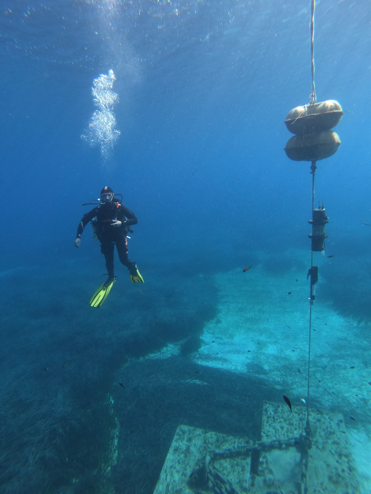

## Welcome

I am a **PhD in Marine Sciences** (University of Cádiz, 2015 — *Summa Cum Laude*, Extraordinary PhD Award & International Mention) specialised in **ocean biogeochemistry**, with a research focus on the **carbon system, ocean acidification, dissolved greenhouse gases** and the **application of artificial intelligence** to long-term oceanographic observation.

Since **December 2024**, I am a **Postdoctoral Researcher under the competitive MOMENTUM programme (2024–2028)** at the [Institute of Marine Sciences of Andalusia (ICMAN-CSIC)](https://www.icman.csic.es/) in Cádiz, Spain, where I lead the **OCEAN–IA** research line — a framework that integrates oceanographic, meteorological and geophysical observations with deep learning to diagnose, reconstruct and predict the impact of natural and anthropogenic pressures on coastal, shelf and deep-sea ecosystems.

::: {.grid}

::: {.g-col-12 .g-col-md-6}
### Carbon System & GHG

- Ocean–atmosphere CO₂, CH₄ and N₂O fluxes
- Ocean acidification and deoxygenation
- Coastal, shelf and deep-sea biogeochemistry
- Polar and Mediterranean carbon dynamics
:::

::: {.g-col-12 .g-col-md-6}
### OCEAN–IA · AI for the Ocean

- Deep learning for pH, CO₂ and GHG reconstruction
- Long-term time-series analysis (GIFT, BOATS)
- Integration of oceanographic, meteorological and seismic data
- Open, reproducible tools aligned with FAIR principles
:::

:::

### At a Glance

::: {.grid}

::: {.g-col-6 .g-col-md-3}

29
SCI Publications

:::

::: {.g-col-6 .g-col-md-3}

16
H-index (GS)

:::

::: {.g-col-6 .g-col-md-3}

731
Total Citations

:::

::: {.g-col-6 .g-col-md-3}

48
Oceanographic Cruises

:::

:::

### Highlights

- **29 peer-reviewed articles** (59 % in Q1 JCR), **3 publications in the global Top 10 %** most-cited in their fields
- **Principal Investigator** of 6 competitive projects — over **€359 k** of funding captured as PI
- Coordinator of the **Gibraltar Fixed Time Series (GIFT)** since 2008 and co-founder of the **Balearic Ocean Acidification Time Series (BOATS)** since 2018
- Fieldwork across the **Southern, Atlantic, Baltic and Mediterranean oceans** — 278 days at sea, 180+ field campaigns
- International collaborations with institutions in **Europe, America, Asia and Africa**
- Representative of the Mediterranean node in the steering committee of **ICONEC (GOA-ON)** and coordinator of the *Risks & Hazards* area of **Conexión Polar CSIC**
- Research outputs cited in the **IPCC SROCC (2019)**, the **IPCC AR6 Synthesis Report (2023)** and the **CLIVAR-Spain 2025** national assessment

---

::: {.column-page}

:::
