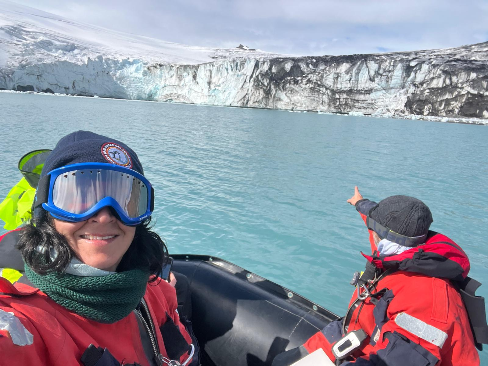
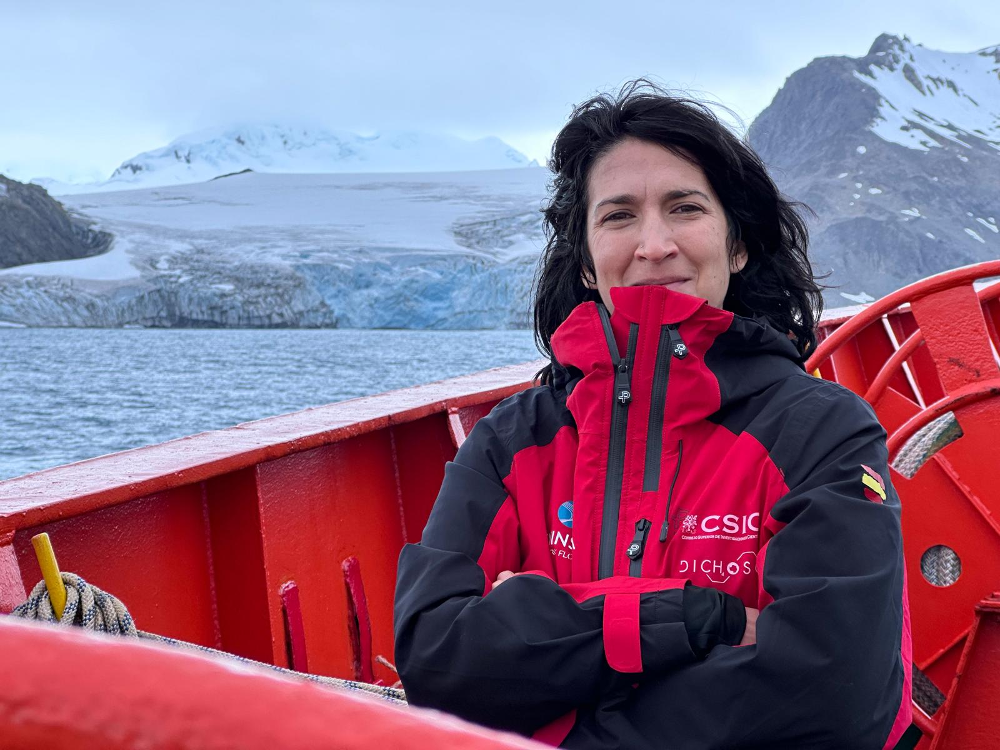
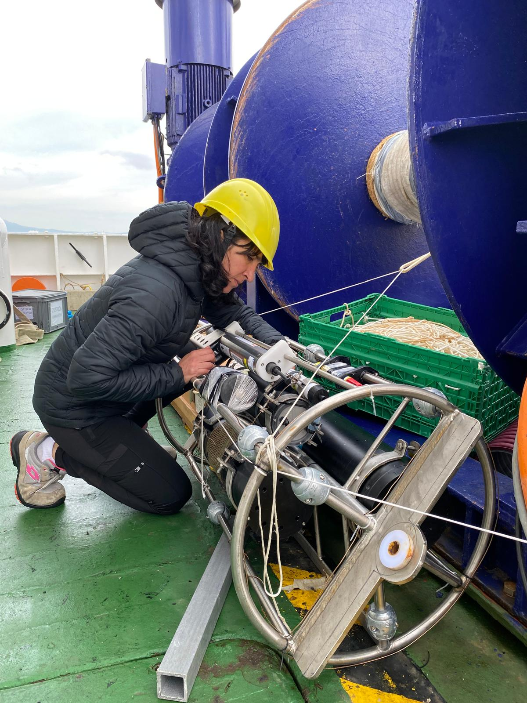
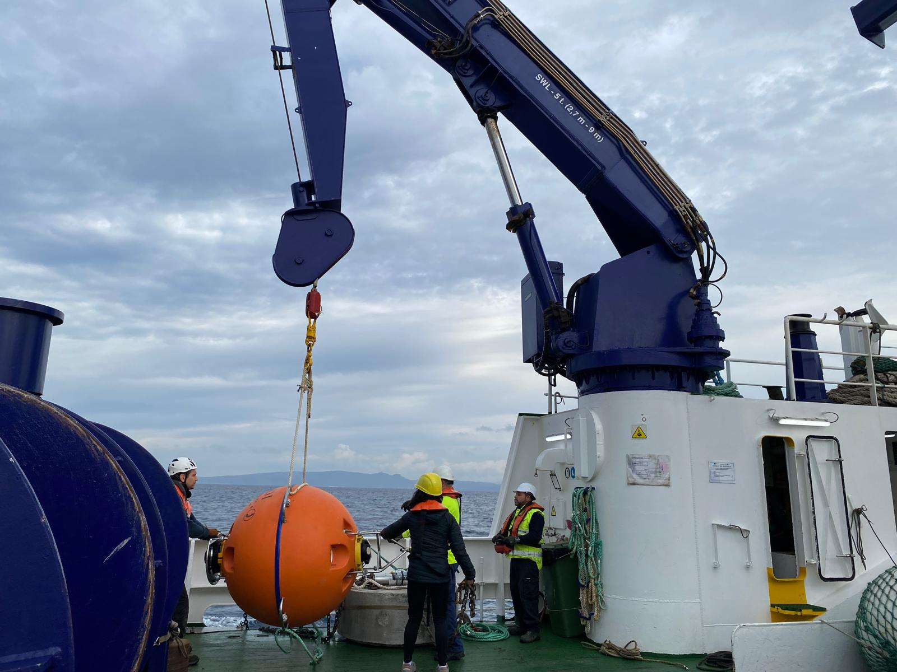
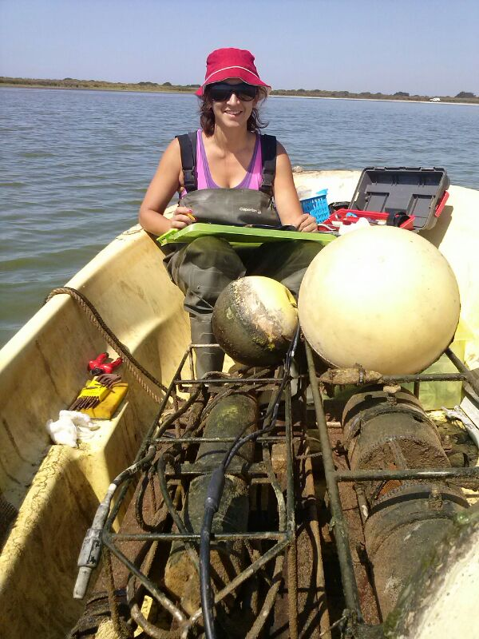

## Research Imagery

A visual collection of fieldwork across different marine ecosystems worldwide.

---

<h3>Spanish Antarctic Campaign</h3>

Facing the BIO Hespérides research vessel at Deception Island, South Shetland Islands

<h3>CTD Deployment</h3>

Deploying a CTD rosette from the deck during open-ocean sampling operations

<h3>CSIC–UTM Operations</h3>

Aerial view of zodiac boats during fieldwork over glacier-fed Antarctic waters

<h3>Glacier Front</h3>

Surveying a tidewater glacier wall on a volcanic beach, western Antarctic Peninsula

<h3>Polar Sampling</h3>

Instrument-laden zodiac at a glacier front during Antarctic carbon-system sampling

<h3>Cabrera Archipelago</h3>

Mooring line with oceanographic sensors - pH, dissolved oxygen, temperature, and salinity monitoring station

<h3>Sensor Maintenance</h3>

Maintenance of moored biogeochemical sensors during oceanographic campaign

<h3>Autonomous Monitoring</h3>

Maintenance of biogeochemical sensors for autonomous long-term monitoring

<h3>Polar Expeditions</h3>

Glacier research - biogeochemical processes in polar cold waters

<h3>Mediterranean Campaign</h3>

Oceanographic operations during research campaign in the Mediterranean Sea

<h3>Field Research</h3>

Field work during marine research expedition

<h3>Professional Profile</h3>

Susana Flecha - Researcher in Ocean Biogeochemistry

<h3>Deception Island, Antarctica</h3>

Water sample collection with oceanographic rosette at Deception Island

<h3>GIFT Mooring Preparation</h3>

Susana Flecha preparing the instrumentation of the Gibraltar Fixed Timeseries (GIFT) mooring in the Strait of Gibraltar

<h3>GIFT Deployment Operation</h3>

Deployment maneuver of the GIFT mooring in the Strait of Gibraltar

<h3>Estuarine Monitoring</h3>

Recovering a moored instrument frame with sensors and buoys in a coastal wetland (SW Spain)

---

## Research Areas

My field work has covered diverse marine ecosystems:

::: {.grid}

::: {.g-col-12 .g-col-md-4}
### Mediterranean Sea
- Balearic Islands
- Strait of Gibraltar
- Western basin
- Coastal time series
:::

::: {.g-col-12 .g-col-md-4}
### Atlantic Ocean
- North Atlantic
- Gulf of Cádiz
- Meridional transects
- Water mass exchange
:::

::: {.g-col-12 .g-col-md-4}
### Polar Regions
- Antarctic Peninsula
- Southern Ocean
- Deception Island & Livingston Island
- Cold water biogeochemistry
:::

:::

---

## Expedition Highlights

- **48 oceanographic cruises** (278 days at sea)
- **>180 field campaigns** in diverse environments
- Research in **Southern Ocean, Atlantic, Mediterranean, and Baltic Seas**
- Locations: Comau Fjord (Chile), Balearic Sea, Guadalquivir estuary, Doñana National Park, Scheldt estuary (Belgium)

---

## Monitoring Programs

### Long-term Time Series

**Gibraltar Fixed Timeseries (GIFT)**

- Coordinated since 2008
- Strait of Gibraltar water mass exchange monitoring
- Carbon system and biogeochemical parameters

**Balearic Ocean Acidification Time Series (BOATS)**

- Co-founded and co-led since 2018
- High-frequency pH and biogeochemical monitoring
- Ocean acidification assessment in Mediterranean coastal waters

**Carbon Observatory Johnson (COJOHNS)**

- Coordinated since 2024
- Johnsons Cove (Caleta Johnson), Livingston Island, Antarctica
- High-frequency pH, pCO₂ and environmental monitoring via an autonomous mooring (since February 2024)
- Air–sea CO₂ fluxes in a glacier-fed Antarctic embayment

---

## International Collaborations

Field research in collaboration with:

- **University of Washington**, Seattle, USA
- **Université de Liège**, Belgium
- **LOCEAN**, Paris, France
- **JAMSTEC**, Japan
- **OGS**, Trieste, Italy
- **Institut National de Recherche Halieutique (INRH)**, Casablanca, Morocco

---

*All images © Susana Flecha. For use of images for educational or outreach purposes, please contact: susana.flecha@csic.es*
